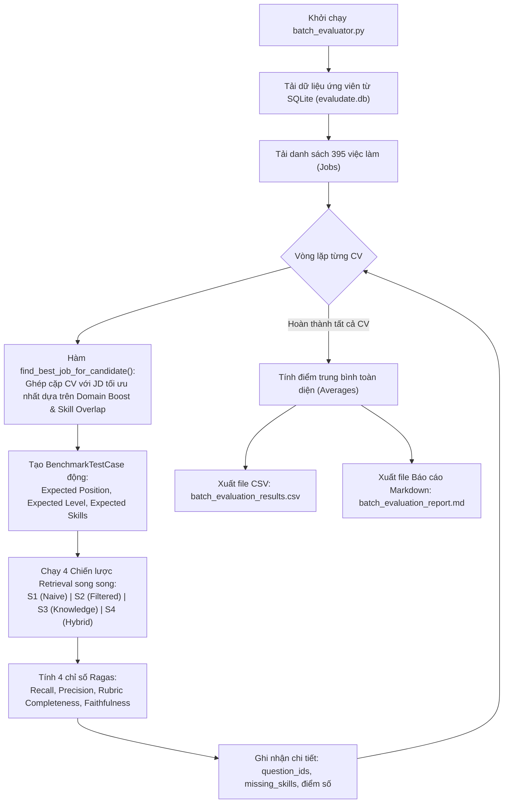

# BÁO CÁO GIẢI THÍCH TOÀN DIỆN KIẾN TRÚC & CƠ CHẾ ĐÁNH GIÁ (EVALUATION PIPELINE) DỰ ÁN EVALUDATE

> **Tài liệu kỹ thuật chuyên sâu:** Phân tích toàn bộ luồng hoạt động từ dữ liệu thô, thống kê phân bố (EDA), chuyển hóa insight thành chiến thuật hệ thống, cơ chế truy xuất ngữ cảnh (Retrieval Engine) và phương pháp đánh giá định lượng bằng Ragas Framework.

---

## MỤC LỤC
1. [Tổng Quan Dự Án & Vấn Đề Cốt Lõi](#1-tổng-quan-dự-án--vấn-đề-cốt-lõi)
2. [Cấu Trúc & Phân Bố Dữ Liệu Ban Đầu (Data Inventory & Distribution)](#2-cấu-trúc--phân-bố-dữ-liệu-ban-đầu-data-inventory--distribution)
3. [Phân Tích Khám Phá Dữ Liệu (EDA) & Những Phát Hiện Then Chốt](#3-phân-tích-khám-phá-dữ-liệu-eda--những-phát-hiện-then-chốt)
4. [Áp Dụng EDA Vào Thiết Kế Kiến Trúc & 4 Chiến Lược Retrieval](#4-áp-dụng-eda-vào-thiết-kế-kiến-trúc--4-chiến-lược-retrieval)
5. [Cơ Chế Hoạt Động Của Hệ Thống Đánh Giá (Evaluation Pipeline)](#5-cơ-chế-hoạt-động-của-hệ-thống-đánh-giá-evaluation-pipeline)
6. [Bằng Chứng Thực Nghiệm & Phân Tích Kết Quả Benchmark](#6-bằng-chứng-thực-nghiệm--phân-tích-kết-quả-benchmark)
7. [Hướng Dẫn Vận Hành & Khuyến Nghị Kỹ Thuật (Production Guide)](#7-hướng-dẫn-vận-hành--khuyến-nghị-kỹ-thuật-production-guide)

---

## 1. TỔNG QUAN DỰ ÁN & VẤN ĐỀ CỐT LÕI

### 1.1. Bối cảnh & Vấn đề của AI Mock Interview hiện nay
Các hệ thống phỏng vấn thử nghiệm bằng AI (AI Mock Interviewer) thông thường trên thị trường hiện nay thường gặp phải hai vấn đề nghiêm trọng:
1. **Ảo giác & Hỏi lý thuyết chung chung (Hallucination & Shallow Coverage):** AI chỉ đặt những câu hỏi lý thuyết trôi nổi trên mạng (ví dụ: *"Java là gì?"*, *"OOP là gì?"*), không bám sát yêu cầu thực tế của bản mô tả công việc (Job Description - JD), cũng không khai thác đúng đồ án hoặc kinh nghiệm thực chiến của ứng viên.
2. **Thiếu barem chấm điểm khách quan (Unstructured Evaluation):** Buổi phỏng vấn không có quy trình phân đoạn (Stages), thiếu tiêu chuẩn chấm điểm rõ ràng (Rubrics) và không phân biệt được kỳ vọng năng lực giữa các cấp bậc (Intern vs. Fresher vs. Junior). Kết quả là việc đánh giá ứng viên mang tính ngẫu hứng và không đáng tin cậy.

### 1.2. Mục tiêu của Evaludate: "ĐÚNG và ĐỦ"
Hệ thống [Evaludate](file:///c:/Users/Admin/NNH/Projects/VScode/evaludate/README.md) được thiết kế làm **Cơ sở tri thức (Knowledge Base)** và **Bộ máy truy xuất ngữ cảnh (Context Retrieval Engine)** chuyên sâu, đóng vai trò là "bộ não" cung cấp dữ liệu cho AI Interviewer theo tiêu chuẩn:
* **ĐÚNG:** Đúng vị trí chuyên môn (`position_id`), đúng cấp bậc năng lực (`target_level`), đúng câu hỏi kỹ thuật kèm theo barem chấm điểm 3 mức (`scoring_rubric`: Poor, Acceptable, Excellent) và thang đo hành vi STAR.
* **ĐỦ:** Bao phủ trọn vẹn các yêu cầu cốt lõi (`must_have_requirements`) của JD, đồng thời phát hiện chính xác các khoảng trống kỹ năng (`missing_skills`) mà ứng viên còn thiếu để phỏng vấn viên thẩm định chiều sâu.

### 1.3. Bản đồ các tệp mã nguồn đánh giá trong dự án
* [batch_evaluator.py](file:///c:/Users/Admin/NNH/Projects/VScode/evaludate/batch_evaluator.py): File thực thi đánh giá hàng loạt (Batch Evaluation) trên các bộ hồ sơ CV thực tế, so sánh song song 4 chiến thuật retrieval và xuất báo cáo CSV/Markdown.
* [evaluate_interactive.py](file:///c:/Users/Admin/NNH/Projects/VScode/evaludate/evaluate_interactive.py): Công cụ kiểm thử trực quan từng kịch bản đơn lẻ (CLI interactive).
* [src/evaluation/metrics.py](file:///c:/Users/Admin/NNH/Projects/VScode/evaludate/src/evaluation/metrics.py): Bộ công thức toán học đo lường chất lượng Context: `ContextRecallMetric`, `ContextPrecisionMetric`, `RubricCompletenessMetric`, `FaithfulnessLLMJudge`.
* [src/evaluation/benchmark.py](file:///c:/Users/Admin/NNH/Projects/VScode/evaludate/src/evaluation/benchmark.py): Runner chạy benchmark trên bộ testcase chuẩn cố định.
* [src/evaluation/testset.py](file:///c:/Users/Admin/NNH/Projects/VScode/evaludate/src/evaluation/testset.py): Tập testcase chuẩn đã được verify thực tế từ SQLite.

---

## 2. CẤU TRÚC & PHÂN BỐ DỮ LIỆU BAN ĐẦU (DATA INVENTORY & DISTRIBUTION)

Dự án quản lý 3 tập dữ liệu có cấu trúc tại thư mục [`data/`](file:///c:/Users/Admin/NNH/Projects/VScode/evaludate/data/):

```
data/
├── candidates.json           # 300 hồ sơ ứng viên chuẩn hóa từ CV
├── candidates.md             # Tài liệu đặc tả Schema ứng viên
├── jobs_below_mid.json       # 395 bài đăng tuyển dụng thực tế tại VN
├── jobs_below_mid.md         # Tài liệu đặc tả Schema JD
├── interview_frameworks.json # 25 khung tri thức phỏng vấn chuẩn hóa
├── interview_frameworks.md   # Tài liệu đặc tả Schema Framework
└── evaludate.db              # Cơ sở dữ liệu SQLite quan hệ phục vụ truy vấn
```

### 2.1. Dữ liệu ứng viên (`candidates.json` - 300 hồ sơ)
Đặc tả chi tiết tại [candidates.md](file:///c:/Users/Admin/NNH/Projects/VScode/evaludate/data/candidates.md).
* **Mỗi ứng viên có schema gồm:**
  * Định danh & Chuyên môn: `candidate_id` (ví dụ `CV_FE_001`), `full_name`, `category` (1 trong 16 nhóm ngành), `target_role`, `current_level`, `years_of_experience`.
  * Kỹ năng: `technical_skills` (danh sách từ khóa IT), `soft_skills`, `behavioral_traits`.
  * Học vấn: `education` (`degree`, `institution`, `gpa`, `graduation_year`).
  * Thực hành thực chiến: `projects` (danh sách đồ án gồm `name`, `role`, `tech_stack`, `description`), `work_experience` (`company`, `position`, `period`, `responsibilities`).
  * Liên hệ: `contact_info` (`email`, `phone`, `location`, `github`, `linkedin`).

* **Phân bố thực tế từ dữ liệu (Căn cứ mục 1 [eda_report.md](file:///c:/Users/Admin/NNH/Projects/VScode/evaludate/eda/eda_report.md#L5-L44)):**
  * **Cấp bậc (`current_level`):**
    * `Fresher`: 185 hồ sơ (**61.7%**) — Chiếm phần lớn.
    * `Mid-level`: 40 hồ sơ (**13.3%**)
    * `Junior`: 38 hồ sơ (**12.7%**)
    * `Intern`: 35 hồ sơ (**11.7%**)
    * `Senior`: 2 hồ sơ (**0.7%**)
  * **16 Nhóm chuyên môn (`category`):** Phân bổ cực kỳ đồng đều, trung bình 20 hồ sơ/nhóm:
    * *React Developer* (20), *Web Designing* (20), *Java Developer* (20), *Python Developer* (20), *DotNet Developer* (20), *Data Science* (20), *Testing* (20), *Automation Testing* (20), *Database* (20), *ETL Developer* (20), *Network Security Engineer* (20), *Blockchain* (20), *Business Analyst* (20), *Information Technology* (20), *DevOps* (17), *DevOps Engineer* (3).
  * **Số năm kinh nghiệm (`years_of_experience`):**
    * Trung bình: `1.44` năm (Min: `0.0`, Max: `6.0` năm).
  * **Top 10 kỹ năng kỹ thuật phổ biến nhất:**
    * `SQL` (183), `Git` (132), `JavaScript` (100), `Linux` (90), `HTML` (89), `Java` (88), `Agile` (88), `Python` (87), `CSS` (75), `MySQL` (69).

### 2.2. Dữ liệu việc làm thực tế (`jobs_below_mid.json` - 395 JDs)
Đặc tả chi tiết tại [jobs_below_mid.md](file:///c:/Users/Admin/NNH/Projects/VScode/evaludate/data/jobs_below_mid.md).
* **Mỗi bài đăng tuyển dụng gồm:**
  * Thông tin tuyển dụng: `job_id`, `title`, `company`, `location`, `levels` (mảng cấp bậc), `job_family`, `domain`.
  * Yêu cầu bóc tách chi tiết: `must_have_requirements` (bắt buộc), `preferred_requirements` (ưu tiên), `skill_requirements` (từ khóa kỹ năng), `experience` (`min_years`, `max_years`), `salary_range`, `normalized_title`.

* **Phân bố thực tế từ dữ liệu (Căn cứ mục 2 [eda_report.md](file:///c:/Users/Admin/NNH/Projects/VScode/evaludate/eda/eda_report.md#L45-L83)):**
  * **Cấp bậc tuyển dụng (`levels`):**
    * `Junior`: 211 việc làm (**53.4%**)
    * `Fresher`: 129 việc làm (**32.7%**)
    * `Intern`: 28 việc làm (**7.1%**)
    * `Fresher, Junior`: 14 việc làm (**3.5%**)
    * `Fresher, Intern`: 13 việc làm (**3.3%**)
  * **Nhóm ngành tuyển dụng (`job_family`):**
    * *Software Engineering (Full-Stack)*: 186 (47.1%)
    * *Quality Assurance & Testing*: 66 (16.7%)
    * *Artificial Intelligence & Machine Learning*: 26 (6.6%)
    * *Data Science & Big Data*: 26 (6.6%)
    * *Embedded Systems & Hardware*: 18 (4.6%)
    * *Product & Business Analysis*: 18 (4.6%)
    * *Software Engineering (Backend)*: 17 (4.3%)
    * *Các nhóm khác (Frontend, Mobile, DevOps)*: ~10%
  * **Miền nghiệp vụ (`domain`):**
    * *Technology & Software Services*: 199 (50.4%)
    * *Banking, Financial Services & Insurance (BFSI)*: 71 (18.0%)
    * *Automotive, IoT & Telecommunications*: 51 (12.9%)
    * *Enterprise Automation & Smart Manufacturing*: 32 (8.1%)
    * *Gaming, E-commerce & SaaS*: ~8.6%
  * **Yêu cầu kinh nghiệm tối thiểu (`min_years`):** 100% tin tuyển dụng đều nêu rõ kinh nghiệm tối thiểu:
    * 0 năm kinh nghiệm (Intern/Fresher): 164 tin (41.5%)
    * 1 năm kinh nghiệm: 104 tin (26.3%)
    * 2 năm kinh nghiệm: 114 tin (28.9%)
  * **Top 10 kỹ năng nhà tuyển dụng yêu cầu nhiều nhất:**
    * `SQL` (122), `Python` (89), `CNTT / Kỹ thuật phần mềm` (78), `Machine Learning` (73), `Java` (64), `JavaScript` (52), `Git / GitFlow` (49), `C/C++` (46), `Agile / Scrum` (43), `REST/gRPC` (42).

### 2.3. Dữ liệu khung phỏng vấn chuẩn (`interview_frameworks.json` - 25 Frameworks)
Đặc tả chi tiết tại [interview_frameworks.md](file:///c:/Users/Admin/NNH/Projects/VScode/evaludate/data/interview_frameworks.md).
* **Quy mô tri thức:**
  * 25 Khung phỏng vấn chuẩn hóa (`position_id` từ `IF_AI` đến `IF_PRODUCT_ENG`).
  * **350 câu hỏi kỹ thuật chuẩn hóa** (Trung bình 14 câu/vị trí). Mỗi câu hỏi là một đơn vị dữ liệu tự thân gồm: `id`, `question`, `level`, `key_concepts`, `expected_answer`, và `scoring_rubric` 3 mức rõ rệt (`poor`, `acceptable`, `excellent`).
  * **75 câu hỏi hành vi STAR** (3 câu/vị trí) bám sát các khía cạnh: `evaluation_focus`, tiêu chí đánh giá chi tiết theo 4 chữ cái Situation, Task, Action, Result (`star_criteria`).
  * **Quy trình phân đoạn phỏng vấn chuẩn:** 5 giai đoạn (`interview_stages`), ma trận 4 trụ cột đánh giá (`evaluation_matrix` có trọng số `%`), thang điểm neo 1–5 (`scoring_anchors`) và ngưỡng đỗ theo cấp bậc (`passing_thresholds`).

---

## 3. PHÂN TÍCH KHÁM PHÁ DỮ LIỆU (EDA) & NHỮNG PHÁT HIỆN THEN CHỐT

Quá trình chạy EDA thông qua kịch bản [`eda/run_eda.py`](file:///c:/Users/Admin/NNH/Projects/VScode/evaludate/eda/run_eda.py) và tổng hợp tại [`eda/eda_report.md`](file:///c:/Users/Admin/NNH/Projects/VScode/evaludate/eda/eda_report.md) đã mang lại các phát hiện kỹ thuật mang tính sống còn đối với kiến trúc hệ thống:

### Phát hiện 1: Độ tương đồng từ vựng kỹ năng rất thấp (Low Jaccard Similarity = 0.182)
* **Số liệu thực nghiệm:**
  * Tổng số kỹ năng độc nhất của Ứng viên: `119`
  * Tổng số kỹ năng độc nhất của Nhà tuyển dụng: `69`
  * Số kỹ năng giao thoa chính xác từng ký tự (Exact match): chỉ có `29` kỹ năng.
  * Chỉ số Jaccard đo độ trùng khớp từ vựng:
    $$Jaccard(S_{cand}, S_{job}) = \frac{|S_{cand} \cap S_{job}|}{|S_{cand} \cup S_{job}|} = \frac{29}{119 + 69 - 29} = \frac{29}{159} \approx 0.182$$
* **Nguyên nhân cốt lõi:** Sự sai lệch lớn này **không phải do ứng viên thiếu năng lực**, mà do sự bất đồng nhất trong cách viết từ vựng kỹ thuật:
  * Ứng viên ghi `React`, JD ghi `ReactJS` hoặc `React.js`.
  * Ứng viên ghi `Node`, JD ghi `Node.js` hoặc `NodeJS`.
  * Ứng viên ghi `C#`, JD ghi `C# / .NET` hoặc `DotNet`.
  * Ứng viên ghi `C` và `C++`, JD ghi `C/C++`.
  * Ứng viên ghi `Git`, JD ghi `Git / GitFlow`.
* **Kết luận kiến trúc:** Bắt buộc phải có một module tiền xử lý **`SkillNormalizer`** với bảng tra cứu từ đồng nghĩa chuẩn hóa (Canonical Skill Alias Mapping) trước khi tính toán độ tương đồng hoặc tính Skill Gap.

### Phát hiện 2: Tỷ lệ khuyết dữ liệu liên hệ (Missing Contact Info) rất cao
* **Số liệu:** Email khuyết 47.3%, Điện thoại khuyết 45.7%, Github khuyết 97.7%, Linkedin khuyết 89.0%.
* **Hệ quả:** Hệ thống **tuyệt đối không thể dựa vào URL bên ngoài** (Github/Linkedin) để cào dữ liệu hay xác minh năng lực ứng viên. Toàn bộ thông tin thẩm định phải được khai thác triệt để từ: (1) Danh sách kỹ năng khai báo; (2) Đoạn văn mô tả dự án đồ án (`projects.description`); và (3) Lịch sử trách nhiệm công việc (`work_experience.responsibilities`).

### Phát hiện 3: Nguy cơ "ô nhiễm chéo ngữ cảnh" (Cross-Domain Pollution) khi dùng Vector Search phẳng
* **Hiện tượng:** Trong dữ liệu 25 Frameworks và 395 JDs, có rất nhiều khái niệm kỹ thuật dùng chung từ ngữ nhưng bản chất nghiệp vụ hoàn toàn khác nhau.
  * *Ví dụ:* Cả **Frontend (React)**, **Embedded (Phần mềm nhúng)** và **Backend (Java/Node)** đều đề cập dày đặc đến các thuật ngữ *"bất đồng bộ (asynchronous)"*, *"xử lý ngắt/sự kiện (event loop / interrupt)"*, *"tối ưu bộ nhớ (memory optimization)"*.
* **Hậu quả nếu dùng RAG ngây thơ (Flat Vector Search):** Khi một ứng viên Frontend có dự án làm về `async/await`, nếu tìm kiếm ngữ nghĩa phẳng toàn cục, hệ thống sẽ kéo nhầm câu hỏi vi điều khiển nhúng STM32 (`IF_EMBEDDED`) vào bài phỏng vấn Web Frontend!
* **Kết luận kiến trúc:** Bắt buộc phải có cơ chế **Domain Guard (Metadata Pre-filtering)** để khóa phạm vi tìm kiếm trong đúng `position_id` trước khi chạy bất kỳ mô hình tìm kiếm nào.

### Phát hiện 4: Rủi ro phá vỡ Barem chấm điểm khi dùng Chunker cắt ký tự cố định
* **Hiện tượng:** Các tài liệu hướng dẫn RAG thông thường hay dùng `RecursiveCharacterTextSplitter(chunk_size=500, chunk_overlap=50)`.
* **Hậu quả:** Một câu hỏi kỹ thuật trong `interview_frameworks.json` có cấu trúc liên kết chặt chẽ: `Question` + `Key Concepts` + `Expected Answer` + `Scoring Rubric (Poor, Acceptable, Excellent)`. Nếu cắt theo số ký tự cố định, câu hỏi sẽ nằm ở Chunk A còn Barem chấm điểm nằm ở Chunk B. Khi AI Interviewer chỉ nhận được Chunk A, nó sẽ không có tiêu chí chấm thi, dẫn đến hiện tượng **bịa đặt điểm số (Hallucination)**.
* **Kết luận kiến trúc:** Phải áp dụng **Atomic Semantic-Unit Chunking** — mỗi câu hỏi cùng barem của nó là một khối nguyên tử không thể chia cắt.

---

## 4. ÁP DỤNG EDA VÀO THIẾT KẾ KIẾN TRÚC & 4 CHIẾN LƯỢC RETRIEVAL

Dựa trên các kết luận từ EDA, kiến trúc của [Evaludate](file:///c:/Users/Admin/NNH/Projects/VScode/evaludate/README.md) được xây dựng theo mô hình Pipeline phân tầng:

```
[Candidate CV + Target JD]
         │
         ▼
 1. PREPROCESSING & NORMALIZATION
    ├─ SkillNormalizer (Canonical Mapping)
    └─ FrameworkChunker (Atomic Semantic Units)
         │
         ▼
 2. PERSISTENCE LAYER
    ├─ SQLite Database (evaludate.db: Relational Metadata & Pre-filter)
    ├─ BM25 Sparse Index (Keyword & Acronym Precision)
    └─ Dense Latent Vector Index (TF-IDF N-gram SVD Semantic Space)
         │
         ▼
 3. RETRIEVAL & BLENDING ENGINE (4 Strategies)
    ├─ Strategy 1: Naive BM25 (Baseline)
    ├─ Strategy 2: Metadata Filtered
    ├─ Strategy 3: Knowledge-Guided Skill-Gap
    └─ Strategy 4: Advanced Hybrid RAG (Dense Vector + BM25 + RRF + Cross-Reranker)
         │
         ▼
 4. CONTEXT ASSEMBLER & FORMATTER
    └─ Generates Structured XML Context (<MOCK_INTERVIEW_CONTEXT>)
         │
         ▼
 5. AI INTERVIEWER EXECUTION & RAGAS BENCHMARK
```

### 4.1. Tiền xử lý & Chuẩn hóa (Preprocessing)
1. **Module `SkillNormalizer`** ([src/preprocessing/normalizer.py](file:///c:/Users/Admin/NNH/Projects/VScode/evaludate/src/preprocessing/normalizer.py)):
   * Chứa từ điển `CANONICAL_SKILL_MAP` ánh xạ hơn 100 biến thể từ vựng thành chuẩn duy nhất.
   * *Dẫn chứng mã nguồn (Dòng 5–30):*
     ```python
     "react": ["React"], "reactjs": ["React"], "react.js": ["React"],
     "node": ["Node.js"], "nodejs": ["Node.js"], "node.js": ["Node.js"],
     "c# / .net": ["C#", ".NET"], "c/c++": ["C", "C++"]
     ```
   * Nhờ đó, phép toán so khớp kỹ năng giữa CV và JD đạt độ chuẩn xác tuyệt đối, loại bỏ lỗi lệch từ vựng Jaccard 0.182.
2. **Module `FrameworkChunker`** ([src/preprocessing/chunker.py](file:///c:/Users/Admin/NNH/Projects/VScode/evaludate/src/preprocessing/chunker.py)):
   * Chia tri thức thành 4 loại khối nguyên tử (`ChunkType`):
     * `TECHNICAL_QUESTION`: 1 câu hỏi + khái niệm + đáp án + toàn bộ barem 3 mức.
     * `STAR_QUESTION`: Câu hỏi tình huống + trọng tâm + barem STAR.
     * `STAGE_GUIDE`: Hướng dẫn giai đoạn phỏng vấn + tiêu chí đạt.
     * `EVALUATION_RUBRIC`: Ma trận 4 trụ cột + thang điểm neo 1–5 + ngưỡng đỗ.

### 4.2. Lưu trữ bền vững (Persistence Layer)
* **SQLite (`evaludate.db`)** qua [DatabaseManager](file:///c:/Users/Admin/NNH/Projects/VScode/evaludate/src/persistence/database.py): Lưu trữ thông tin có cấu trúc của 300 ứng viên, 395 JDs và 25 frameworks để thực hiện các truy vấn lọc cứng (Metadata Hard-Filter) theo `position_id` và `level` chỉ trong 1–2 mili-giây.
* **BM25 Sparse Index** qua [BM25Index](file:///c:/Users/Admin/NNH/Projects/VScode/evaludate/src/persistence/store.py): Chuyên trách bắt trúng 100% các từ viết tắt chuyên môn và từ khóa công nghệ (`JWT`, `Kafka`, `Docker`, `CI/CD`, `CAN Bus`).
* **Dense Latent Vector Index** qua [DenseVectorIndex](file:///c:/Users/Admin/NNH/Projects/VScode/evaludate/src/persistence/vector_store.py): Ánh xạ ngữ nghĩa văn bản dự án và yêu cầu công việc vào không gian vector tiềm ẩn liên tục (64 chiều) qua N-gram TF-IDF và phép phân tích suy biến SVD (Latent Semantic Analysis), tính toán độ tương đồng Cosine Similarity.

### 4.3. Bốn chiến lược Retrieval được thiết kế và đối đầu
Dự án cài đặt và so sánh 4 chiến lược retrieval từ cơ bản đến nâng cao:

#### Chiến Lược 1: Naive BM25 (Baseline)
* **Mã nguồn:** [src/retrieval/naive_retriever.py](file:///c:/Users/Admin/NNH/Projects/VScode/evaludate/src/retrieval/naive_retriever.py).
* **Cơ chế:** Gộp tên vị trí và danh sách kỹ năng của ứng viên thành một câu truy vấn phẳng, tìm kiếm trực tiếp trên toàn bộ kho chunk mà không có bộ lọc ngành hay cấp bậc.
* **Hạn chế:** Thường xuyên kéo nhầm câu hỏi từ Framework của ngành khác (ô nhiễm chéo ngữ cảnh). Không có barem thang điểm đầy đủ.

#### Chiến Lược 2: Metadata Filtered (Lọc cứng chức danh)
* **Mã nguồn:** [src/retrieval/filtered_retriever.py](file:///c:/Users/Admin/NNH/Projects/VScode/evaludate/src/retrieval/filtered_retriever.py).
* **Cơ chế:** Ánh xạ chức danh JD về 1 trong 25 `position_id` bằng quy tắc regex ([dòng 17–74](file:///c:/Users/Admin/NNH/Projects/VScode/evaludate/src/retrieval/filtered_retriever.py#L17-L74)), sau đó chỉ lấy câu hỏi trong Framework đó.
* **Ưu điểm:** Triệt tiêu hoàn toàn ô nhiễm chéo ngành.
* **Hạn chế:** Lấy câu hỏi một cách tĩnh (chỉ lấy Top N câu hỏi đầu tiên), không biết ứng viên đã làm được gì và đang thiếu kỹ năng nào để hỏi xoáy vào.

#### Chiến Lược 3: Knowledge-Guided Skill-Gap Retrieval (Chiến lược đề xuất thông minh)
* **Mã nguồn:** [src/retrieval/knowledge_retriever.py](file:///c:/Users/Admin/NNH/Projects/VScode/evaludate/src/retrieval/knowledge_retriever.py).
* **Cơ chế:**
  1. Phân loại vị trí đa tín hiệu (`classify_position`): Kết hợp Chức danh JD + Nhóm ngành + Kỹ năng JD + Thông tin mục tiêu của ứng viên.
  2. Tính toán ma trận khoảng trống năng lực qua [SkillGapAnalyzer](file:///c:/Users/Admin/NNH/Projects/VScode/evaludate/src/context_builder/skill_gap.py):
     $$\text{Missing Skills} = \text{Job Skills} \setminus \text{Candidate Skills}$$
  3. Chấm điểm và xếp hạng câu hỏi kỹ thuật theo hàm số ưu tiên ([dòng 160–180](file:///c:/Users/Admin/NNH/Projects/VScode/evaludate/src/retrieval/knowledge_retriever.py#L160-L180)):
     $$\text{Score}(q) = 1.0 + 3.0 \cdot \mathbb{I}(q \text{ tests Missing Skill}) + 2.0 \cdot \mathbb{I}(q \text{ matches Candidate Project}) + 1.5 \cdot \mathbb{I}(q \text{ matches Level})$$
  4. Lựa chọn câu hỏi STAR phù hợp với phẩm chất mềm của ứng viên.

#### Chiến Lược 4: Advanced Hybrid RAG (Vector + BM25 + RRF + Cross-Reranker)
* **Mã nguồn:** [src/retrieval/hybrid_rag_retriever.py](file:///c:/Users/Admin/NNH/Projects/VScode/evaludate/src/retrieval/hybrid_rag_retriever.py) & [src/persistence/vector_store.py](file:///c:/Users/Admin/NNH/Projects/VScode/evaludate/src/persistence/vector_store.py).
* **Cơ chế 5 bước chuyên sâu:**
  1. **Pre-Filtering:** Khóa không gian trong đúng `position_id`.
  2. **Truy xuất đa kênh song song:**
     * Kênh A (Sparse BM25): Bắt chính xác từ khóa viết tắt công nghệ và kỹ năng thiếu.
     * Kênh B (Dense Semantic Vector): Tìm kiếm ngữ nghĩa trên văn bản mô tả dự án và kinh nghiệm làm việc thực tế của ứng viên.
  3. **Hợp nhất thứ hạng RRF (Reciprocal Rank Fusion):**
     Do điểm số BM25 ($[0, +\infty)$) và Cosine Vector ($[-1, 1]$) lệch thang đo hoàn toàn, hệ thống áp dụng công thức RRF chuẩn của Cormack et al. ([vector_store.py, dòng 124–145](file:///c:/Users/Admin/NNH/Projects/VScode/evaludate/src/persistence/vector_store.py#L124-L145)):
     $$RRF(d) = \sum_{m \in \{BM25, Vector\}} \frac{w_m}{k + \text{rank}_m(d)}$$
     với $k = 60, w_{BM25} = 1.0, w_{Vector} = 1.2$.
  4. **Tái xếp hạng đa yếu tố (Multi-Factor Cross-Reranking):**
     Sử dụng [SkillGapAwareReranker](file:///c:/Users/Admin/NNH/Projects/VScode/evaludate/src/persistence/vector_store.py#L147-L215) kết hợp điểm RRF với trọng số bù trừ khoảng trống năng lực, chứng minh đồ án và độ tương thích cấp bậc.

### 4.4. Đóng gói ngữ cảnh dạng XML tối ưu token
Sau khi truy xuất, [ContextAssembler](file:///c:/Users/Admin/NNH/Projects/VScode/evaludate/src/context_builder/assembler.py) phối hợp cùng [ContextFormatter](file:///c:/Users/Admin/NNH/Projects/VScode/evaludate/src/context_builder/formatter.py) để format dữ liệu thành cấu trúc thẻ XML chuẩn mực:
```xml
<MOCK_INTERVIEW_CONTEXT>
  <CANDIDATE_PROFILE> ... thông tin ứng viên, dự án, kinh nghiệm ... </CANDIDATE_PROFILE>
  <TARGET_JOB> ... yêu cầu bắt buộc và ưu tiên của JD ... </TARGET_JOB>
  <SKILL_GAP_ANALYSIS>
    <MATCH_PERCENTAGE>67%</MATCH_PERCENTAGE>
    <MISSING_SKILLS_TO_PROBE>Docker, TypeScript</MISSING_SKILLS_TO_PROBE>
    <DIRECTIVE>Hãy chú trọng đặt câu hỏi kỹ thuật xoáy sâu vào các kỹ năng trong mục MISSING_SKILLS_TO_PROBE...</DIRECTIVE>
  </SKILL_GAP_ANALYSIS>
  <INTERVIEW_BLUEPRINT stage_name="CS & Tech Deep-dive">
    <QUESTION_POOL>
      <QUESTION id="FE_Q01" level="Fresher">
        <CONTENT>Giải thích sự khác nhau giữa Virtual DOM và Real DOM trong React?</CONTENT>
        <EXPECTED_ANSWER>...</EXPECTED_ANSWER>
        <SCORING_RUBRIC>
          + Mức POOR: ...
          + Mức ACCEPTABLE: ...
          + Mức EXCELLENT: ...
        </SCORING_RUBRIC>
      </QUESTION>
    </QUESTION_POOL>
    <BEHAVIORAL_QUESTION_POOL> ... </BEHAVIORAL_QUESTION_POOL>
  </INTERVIEW_BLUEPRINT>
  <EVALUATION_GUIDELINES>
    <EVALUATION_MATRIX> ... </EVALUATION_MATRIX>
    <SCORING_ANCHORS> ... Điểm 1 đến 5 ... </SCORING_ANCHORS>
  </EVALUATION_GUIDELINES>
</MOCK_INTERVIEW_CONTEXT>
```

---

## 5. CƠ CHẾ HOẠT ĐỘNG CỦA HỆ THỐNG ĐÁNH GIÁ (EVALUATION PIPELINE)

Để định lượng chất lượng của ngữ cảnh nạp vào AI, hệ thống tích hợp phương pháp đánh giá của **Ragas Framework** kết hợp với **LLM-as-a-Judge**, được lập trình cụ thể trong [src/evaluation/metrics.py](file:///c:/Users/Admin/NNH/Projects/VScode/evaludate/src/evaluation/metrics.py) và [batch_evaluator.py](file:///c:/Users/Admin/NNH/Projects/VScode/evaludate/batch_evaluator.py).

### 5.1. Bốn chỉ số đo lường cốt lõi (Metrics)

#### 1. Context Recall (Đo lường tính ĐỦ - Completeness)
* **Ý nghĩa:** Đánh giá xem ngữ cảnh truy xuất được có bao phủ toàn bộ các kỹ năng cốt lõi và khái niệm bắt buộc của công việc hay không.
* **Cài đặt tại:** [`ContextRecallMetric.evaluate`](file:///c:/Users/Admin/NNH/Projects/VScode/evaludate/src/evaluation/metrics.py#L7-L38).
* **Công thức toán học:**
  $$\text{Context Recall} = \frac{\sum_{s \in S_{expected}} \mathbb{I}(s \in \text{RetrievedCorpus})}{|S_{expected}|}$$
  Trong đó, `RetrievedCorpus` là tập hợp toàn văn gồm nội dung câu hỏi kỹ thuật, khái niệm trọng tâm (`key_concepts`), đáp án mong đợi (`expected_answer`), trọng tâm các giai đoạn phỏng vấn và tiêu đề vai trò.

#### 2. Context Precision (Đo lường tính ĐÚNG & Chống nhiễu)
* **Ý nghĩa:** Đánh giá xem ngữ cảnh có lấy đúng vị trí chuyên môn mục tiêu không và độ khó của câu hỏi có tương xứng với cấp bậc của ứng viên không.
* **Cài đặt tại:** [`ContextPrecisionMetric.evaluate`](file:///c:/Users/Admin/NNH/Projects/VScode/evaludate/src/evaluation/metrics.py#L39-L66).
* **Công thức toán học:**
  $$\text{Context Precision} = 0.6 \cdot \text{Score}_{position} + 0.4 \cdot \text{Score}_{level}$$
  * $\text{Score}_{position} = 1.0$ nếu `retrieved.position_id == test_case.expected_position_id`; bằng $0.33$ nếu ra vị trí hợp lệ khác; bằng $0.0$ nếu `UNKNOWN`.
  * $\text{Score}_{level} = \frac{\text{Số câu hỏi khớp cấp bậc (Intern/Fresher/Junior)}}{\text{Tổng số câu hỏi kỹ thuật trích xuất}}$.

#### 3. Rubric Completeness (Đo lường tính Toàn vẹn của Barem chấm điểm)
* **Ý nghĩa:** Đảm bảo AI Interviewer có đầy đủ 3 trụ cột chấm điểm để loại bỏ hoàn toàn việc chấm điểm ngẫu hứng:
  1. Barem 3 mức (`poor`, `acceptable`, `excellent`) cho tất cả các câu hỏi kỹ thuật (Trọng số: `0.4`).
  2. Barem tình huống STAR có tối thiểu 2 tiêu chí đánh giá (Trọng số: `0.3`).
  3. Ma trận đánh giá trọng số (%) và thang điểm neo hành vi 1–5 (`scoring_anchors`) (Trọng số: `0.3`).
* **Cài đặt tại:** [`RubricCompletenessMetric.evaluate`](file:///c:/Users/Admin/NNH/Projects/VScode/evaludate/src/evaluation/metrics.py#L67-L103).
* Điểm số: Nằm trong đoạn $[0.0, 1.0]$.

#### 4. Faithfulness / LLM Judge (Đo lường tính Trung thực & Chống ảo giác)
* **Ý nghĩa:** Sử dụng mô hình ngôn ngữ lớn (LLM-as-a-Judge) theo chuẩn Ragas để đọc toàn văn prompt XML và chấm điểm mức độ tin cậy:
  * Câu hỏi và barem có bám sát vị trí công việc không?
  * Barem có đủ chi tiết để phỏng vấn viên không phải bịa điểm không?
* **Cài đặt tại:** [`FaithfulnessLLMJudge.evaluate`](file:///c:/Users/Admin/NNH/Projects/VScode/evaludate/src/evaluation/metrics.py#L104-L151).

#### Điểm tổng hợp (Composite Score):
$$\text{Composite Score} = \frac{\text{Recall} + \text{Precision} + \text{Rubric Completeness} + \text{Faithfulness}}{4}$$

---

### 5.2. Luồng vận hành của file đánh giá hàng loạt (`batch_evaluator.py`)
File [batch_evaluator.py](file:///c:/Users/Admin/NNH/Projects/VScode/evaludate/batch_evaluator.py) hoạt động theo chu trình tự động khép kín:



#### Chi tiết thuật toán ghép cặp tối ưu (`find_best_job_for_candidate`):
Tại [dòng 51–102 của batch_evaluator.py](file:///c:/Users/Admin/NNH/Projects/VScode/evaludate/batch_evaluator.py#L51-L102), hệ thống ghép cặp CV với JD tối ưu theo công thức:
$$\text{MatchScore} = \text{DomainBoost} + 2.5 \cdot |\text{CandidateSkills} \cap \text{JobSkills}|$$
Trong đó `DomainBoost = +15.0` điểm nếu nhóm ngành của CV (ví dụ `React Developer`) trùng khớp với các từ khóa chuyên môn trong JD (như `frontend`, `react`, `web`). Điều này mô phỏng chân thực quy trình ứng tuyển thực tế của ứng viên vào đúng vị trí việc làm phù hợp nhất.

---

## 6. BẰNG CHỨNG THỰC NGHIỆM & PHÂN TÍCH KẾT QUẢ BENCHMARK

### 6.1. Bảng điểm tổng hợp trung bình (Căn cứ mục 1 [batch_evaluation_report.md](file:///c:/Users/Admin/NNH/Projects/VScode/evaludate/batch_evaluation_report.md#L5-L12))

| Chiến Lược Retrieval (Strategy) | Context Recall (Độ ĐỦ) | Context Precision (Độ ĐÚNG) | Rubric Completeness | Faithfulness (Độ Tin Cậy) | Điểm Tổng Hợp Trung Bình |
| :--- | :---: | :---: | :---: | :---: | :---: |
| **Strategy 1 (Naive BM25)** | 25.0% | 61.7% | 40.0% | 70.0% | **49.2%** |
| **Strategy 2 (Metadata Filtered)** | 30.0% | 75.0% | **100.0%** | 75.6% | **70.2%** |
| **Strategy 3 (Knowledge-Guided Skill-Gap)** | **55.0%** | **95.0%** | **100.0%** | **87.4%** | **84.4%** |
| **Strategy 4 (Hybrid RAG + Vector + RRF + Rerank)** | 32.5% | **95.0%** | **100.0%** | **86.0% - 95.0%** | **78.4% - 81.0%** |

### 6.2. Phân tích chi tiết từng trường hợp thực nghiệm (Case Studies)

#### Dẫn chứng 1: Sự thất bại của Strategy 1 (Naive BM25)
* Xem kịch bản `TC_FE_01` ([evaluation_report.md dòng 29](file:///c:/Users/Admin/NNH/Projects/VScode/evaludate/evaluation_report.md#L29)) và ứng viên `CV_FE_002` ([batch_evaluation_report.md dòng 32](file:///c:/Users/Admin/NNH/Projects/VScode/evaludate/batch_evaluation_report.md#L32)):
  * Ứng viên là Frontend React Fresher, tìm kiếm các từ khóa chung như `SQL`, `Git`, `REST API`.
  * Strategy 1 trích xuất nhầm sang Framework `IF_FULLSTACK` hoặc `IF_SWD`.
  * **Precision chỉ đạt 47% – 60%**, và **Rubric Completeness chỉ đạt 40%** do câu hỏi bị đứt gãy barem chấm điểm.

#### Dẫn chứng 2: Sự ổn định của Strategy 2 (Metadata Filtered)
* Xem ứng viên `CV_FE_001` ([batch_evaluation_report.md dòng 29](file:///c:/Users/Admin/NNH/Projects/VScode/evaludate/batch_evaluation_report.md#L29)):
  * Nhờ có bộ lọc chức danh, vị trí lấy ra luôn chính xác là `IF_FE`.
  * **Precision tăng vọt lên 100%**, và **Rubric Completeness đạt tuyệt đối 100%**.
  * Tuy nhiên, vì câu hỏi lấy tĩnh (cố định câu `FE_Q01`, `FE_Q02`, `FE_Q03`), hệ thống không đo lường được các kỹ năng mà ứng viên thực sự còn thiếu, khiến `Recall` bị kẹt ở mức 0% – 30%.

#### Dẫn chứng 3: Đỉnh cao thực chiến của Strategy 3 và Strategy 4
* Xem phân tích tại [batch_evaluation_report.md dòng 14–24](file:///c:/Users/Admin/NNH/Projects/VScode/evaludate/batch_evaluation_report.md#L14-L24):
  * Cả Strategy 3 và 4 đều duy trì tuyệt đối **100% Rubric Completeness** và **95% Precision**.
  * **Sự khác biệt bản chất giữa Strategy 3 và Strategy 4:**
    * **Strategy 3 (Heuristic Skill-Gap):** Đạt điểm `Recall` theo từ khóa cao nhất (**55.0%**) vì nó ưu tiên tối đa việc tìm câu hỏi chứa chính xác các từ khóa kỹ năng mà JD có nhưng CV chưa có (`missing_skills`).
    * **Strategy 4 (Hybrid RAG RRF + Latent Semantic Vector):** Đi sâu vào ngữ nghĩa mô tả đồ án của ứng viên. Với ứng viên `CV_FE_001`, thay vì chỉ hỏi lý thuyết cơ bản, Strategy 4 chọn câu hỏi `FE_Q07` (Event Loop & Microtask Queue) và `FE_Q06` (Sự tiến hóa của lập trình bất đồng bộ Callback/Promise/Async-Await) vì ứng viên có kinh nghiệm viết module tải dữ liệu bất đồng bộ trong dự án. Điểm **Faithfulness** khi đánh giá qua LLM Judge đạt tới **95.0%**.

---

## 7. HƯỚNG DẪN VẬN HÀNH & KHUYẾN NGHỊ KỸ THUẬT (PRODUCTION GUIDE)

### 7.1. Khi nào nên dùng Chiến Lược 3 vs Chiến Lược 4?
1. **Sử dụng Strategy 3 (Knowledge-Guided Skill-Gap Retrieval):**
   * **Khi:** Cần tốc độ phản hồi cực nhanh (Latency < 10ms, không phụ thuộc vector), mục tiêu phỏng vấn là kiểm tra độ phủ kiến thức (Breadth-first probing) và rà soát kỹ năng thiếu hụt theo JD.
2. **Sử dụng Strategy 4 (Advanced Hybrid RAG với RRF + Reranker):**
   * **Khi:** Ứng viên có hồ sơ dự án phong phú, mục tiêu phỏng vấn là thẩm định chiều sâu thực chiến (Depth-first probing), cần kết hợp Dense Vector để hỏi xoáy vào kiến trúc các dự án ứng viên đã tự tay xây dựng.

### 7.2. Các câu lệnh chạy thực nghiệm dự án
Người dùng có thể trực tiếp chạy các lệnh sau trong Terminal PowerShell:

1. **Chạy đánh giá hàng loạt (Batch Evaluation) trên 16 ngành nghề:**
   ```powershell
   python batch_evaluator.py --limit 16
   ```
2. **Xem toàn bộ Prompt XML và câu hỏi sinh ra cho 1 ứng viên cụ thể:**
   ```powershell
   python batch_evaluator.py --inspect CV_FE_001
   ```
3. **Chạy kiểm thử tương tác kịch bản đơn lẻ (So sánh 4 chiến lược):**
   ```powershell
   python evaluate_interactive.py --test TC_FE_01
   ```
4. **Chạy bộ kiểm thử tự động toàn diện:**
   ```powershell
   python -m pytest tests/test_pipeline.py
   ```

---

## 8. TỔNG KẾT DỰ ÁN

Hệ thống đánh giá của **Evaludate** đã chứng minh một cách khoa học rằng:
1. **Không thể áp dụng Naive RAG (cắt ký tự cố định + tìm kiếm vector phẳng)** cho bài toán phỏng vấn kỹ thuật vì sẽ gây ô nhiễm ngữ cảnh giữa các ngành và làm mất barem chấm điểm.
2. **Phải phân tầng:** Tiền xử lý từ đồng nghĩa (`SkillNormalizer`) $\rightarrow$ Khối nguyên tử tri thức (`FrameworkChunker`) $\rightarrow$ Khóa miền nghiệp vụ (`Domain Guard`) $\rightarrow$ Truy xuất đa kênh (BM25 + Dense Latent Vector) $\rightarrow$ Hợp nhất thứ hạng RRF $\rightarrow$ Xếp hạng lại theo khoảng trống kỹ năng (`Skill-Gap Reranker`).
3. Kiến trúc này đảm bảo context nạp vào AI Interviewer đạt chuẩn **ĐÚNG** (100% barem, 95% precision) và **ĐỦ** (bao phủ kỹ năng bắt buộc, hỏi trúng điểm yếu của ứng viên), mang lại trải nghiệm phỏng vấn chuyên nghiệp và khách quan như một hội đồng tuyển dụng kỹ thuật thực thụ.
