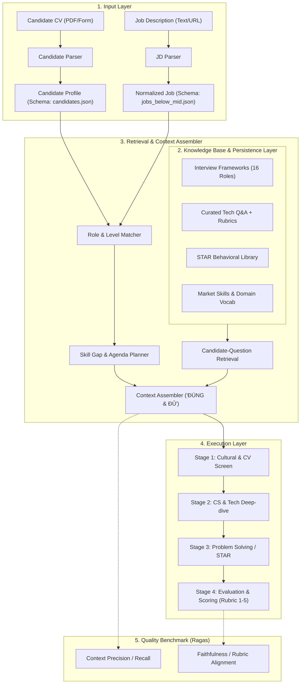

# Evaludate: Knowledge Base & Retrieval Pipeline for AI Mock Interview

Hệ thống xây dựng **Cơ sở tri thức (Knowledge Base)** và **Cơ chế truy xuất ngữ cảnh (Context Retrieval Engine)** chuyên sâu, đóng vai trò là "bộ não" cung cấp dữ liệu **ĐÚNG và ĐỦ** cho AI Interviewer nhằm mô phỏng buổi phỏng vấn tuyển dụng kỹ thuật chân thực và có cấu trúc bài bản.

---

## 1. Tầm Nhìn & Mục Tiêu Dự Án (Vision & Objectives)

Hầu hết các hệ thống Mock Interview hiện nay gặp phải hai lỗi phổ biến:
1. **Ảo giác hoặc hỏi lan man (Hallucination & Shallow Coverage):** AI chỉ hỏi những câu lý thuyết chung chung trích từ Internet, không bám sát yêu cầu thực tế của Job Description (JD).
2. **Thiếu cấu trúc phỏng vấn thực tế (Unstructured Flow):** Buổi phỏng vấn không có các giai đoạn rõ ràng, thiếu barem chấm điểm khách quan (Rubric 1–5), không phân biệt được kỳ vọng giữa các cấp bậc (Intern vs. Fresher vs. Junior).

**Evaludate** giải quyết triệt để bài toán này bằng cách:
* **Chuẩn hóa đầu vào:** Bóc tách Form/PDF của ứng viên và JD thành cấu trúc dữ liệu giàu ngữ cảnh.
* **Xây dựng Knowledge Base vững chắc:** Tích hợp 16 khung phỏng vấn chuẩn hóa (`interview_frameworks`) cùng 395 JD thực tế thị trường Việt Nam (`jobs_below_mid`).
* **Retrieval "ĐÚNG và ĐỦ":**
  * **ĐÚNG:** Đúng vị trí chuyên môn, đúng cấp bậc năng lực, đúng câu hỏi kỹ thuật kèm barem chuẩn.
  * **ĐỦ:** Phủ toàn diện các yêu cầu bắt buộc (`must_have_requirements`) và yêu cầu ưu tiên (`preferred_requirements`) theo từng giai đoạn phỏng vấn.
* **Đo lường & Kiểm thử khoa học:** Ứng dụng **Ragas Framework** để định lượng chất lượng của các chiến thuật Retrieval và Indexing khác nhau.

---

## 2. Phạm Vi Dự Án (Scope)

* **Lĩnh vực công nghệ:** 16 nhóm ngành kỹ thuật then chốt (Software Engineering, Frontend, Java Backend, Python Backend, .NET, QA/QC, DevOps & Cloud, AI/ML, Data Science, Cyber Security, Semiconductor/IC Design, Automotive Embedded, IT Business Analyst, Robotics, UI/UX Design, Systems/IT Infra).
* **Cấp bậc mục tiêu:** Nhóm dưới Mid-level đổ lại, bao gồm **Intern**, **Fresher**, và **Junior (<= 2 năm kinh nghiệm)**.
* **Phạm vi kỹ thuật trong repository:**
  * Thu thập dữ liệu & Đặc tả schema (Data Ingestion & Schemas).
  * Phân tích khám phá dữ liệu (Exploratory Data Analysis - EDA).
  * Thiết kế luồng Ingestion & Kiến trúc lưu trữ bền vững (Persistence Architecture).
  * Thiết kế & thử nghiệm các chiến thuật Retrieval (Hybrid Search, Graph/Relational Filter, Skill-gap Retrieval).
  * Đánh giá và benchmark các chiến lược bằng Ragas metrics.

---

## 3. Kiến Trúc Bộ Dữ Liệu (Data Inventory & Artifacts)

Toàn bộ dữ liệu nguồn được lưu trữ tại thư mục [`data/`](file:///c:/Users/Admin/NNH/Projects/VScode/evaludate/data/):

| Tệp Dữ Liệu Gốc | Tài Liệu Đặc Tả Schema | Quy Mô | Vai Trò Trong Hệ Thống |
| :--- | :--- | :--- | :--- |
| [`candidates.json`](file:///c:/Users/Admin/NNH/Projects/VScode/evaludate/data/candidates.json) | [`candidates.md`](file:///c:/Users/Admin/NNH/Projects/VScode/evaludate/data/candidates.md) | 300 hồ sơ | Chuẩn hóa thông tin ứng viên từ CV/Form (kỹ năng, kinh nghiệm, đồ án, cấp bậc). Dùng để đối soát khoảng trống năng lực (Skill Gap Analysis). |
| [`interview_frameworks.json`](file:///c:/Users/Admin/NNH/Projects/VScode/evaludate/data/interview_frameworks.json) | [`interview_frameworks.md`](file:///c:/Users/Admin/NNH/Projects/VScode/evaludate/data/interview_frameworks.md) | 16 vị trí | **Khung tri thức xương sống:** Quy trình giai đoạn (`interview_stages`), ma trận trọng số (`evaluation_matrix`), thang điểm neo 1–5 (`scoring_anchors`), ngân hàng câu hỏi kỹ thuật có barem chấm 3 mức và câu hỏi STAR. |
| [`jobs_below_mid.json`](file:///c:/Users/Admin/NNH/Projects/VScode/evaludate/data/jobs_below_mid.json) | [`jobs_below_mid.md`](file:///c:/Users/Admin/NNH/Projects/VScode/evaludate/data/jobs_below_mid.md) | 395 bài đăng | **Thước đo thị trường thực tế:** Chứa các yêu cầu `must_have`, `preferred`, `skill_requirements`, `experience` được bóc tách từ các sàn tuyển dụng IT tại Việt Nam. |

---

## 4. Kiến Trúc Luồng Xử Lý (Target System Pipeline)

---

## 5. Chiến Lược Đánh Giá Bằng Ragas (Ragas Evaluation Strategy)

Để chứng minh định lượng rằng context nạp vào AI đạt chuẩn **"ĐÚNG và ĐỦ"**, dự án ứng dụng framework **Ragas** với bộ chỉ số:

1. **Đo lường tính ĐỦ (Completeness / Coverage):**
   * `context_recall`: Đánh giá xem context truy xuất được có chứa toàn bộ các khối kiến thức bắt buộc (`must_have_requirements`) và các kỹ năng cốt lõi (`skill_requirements`) của JD hay không.
2. **Đo lường tính ĐÚNG (Precision & Noise Filter):**
   * `context_precision`: Đo lường tỷ lệ tín hiệu trên nhiễu (Signal-to-noise ratio), đảm bảo không lấy nhầm câu hỏi/barem của role khác hoặc cấp bậc không tương xứng.
   * `context_relevancy`: Đánh giá mức độ khớp nối chặt chẽ giữa profile của ứng viên cụ thể và câu hỏi được lấy ra.
3. **Đo lường tính Trung thực & Bám sát barem (Generation Quality):**
   * `faithfulness`: Đảm bảo các phản hồi và quyết định chấm điểm của AI tuân thủ nghiêm ngặt theo `scoring_rubric` và `scoring_anchors` 1–5 trong `interview_frameworks`, triệt tiêu hoàn toàn ảo giác.

---

## 6. Lộ Trình Triển Khai (Roadmap)

- [x] **Phase 1: Chuẩn hóa Schema & Tài liệu hóa:**
  - Khảo sát dữ liệu thô: 300 candidates, 16 frameworks, 395 JDs.
  - Biên soạn tài liệu chi tiết: [`candidates.md`](file:///c:/Users/Admin/NNH/Projects/VScode/evaludate/data/candidates.md), [`interview_frameworks.md`](file:///c:/Users/Admin/NNH/Projects/VScode/evaludate/data/interview_frameworks.md), [`jobs_below_mid.md`](file:///c:/Users/Admin/NNH/Projects/VScode/evaludate/data/jobs_below_mid.md).
  - Hoàn thiện tài liệu tổng quan hệ thống: [`README.md`](file:///c:/Users/Admin/NNH/Projects/VScode/evaludate/README.md).
- [ ] **Phase 2: Khám phá Dữ liệu Chuyên sâu (EDA):**
  - Thống kê phân bố kỹ năng, tỷ lệ trùng khớp (Overlap) giữa CV ứng viên và JD.
  - Phân tích độ tương thích giữa 16 `position_id` với các chức danh thực tế từ JD.
  - Xác định các trường rủi ro cao (Missing/Sparse fields).
- [ ] **Phase 3: Thiết kế Ingestion Flow & Persistence Architecture:**
  - Mô hình hóa thực thể (Entity-Relationship & Knowledge Graph / Vector schema).
  - Xây dựng giải pháp lưu trữ tối ưu kết hợp (Hybrid Persistence: SQL/Document + Vector Store).
- [ ] **Phase 4: Xây dựng & Tối ưu Retrieval Engine:**
  - Triển khai các chiến thuật: Naive Vector vs. Hierarchical Hybrid Retrieval vs. Knowledge-Mapped Filtering.
  - Tích hợp pipeline đánh giá tự động bằng **Ragas** để so sánh và lựa chọn chiến thuật tốt nhất.
