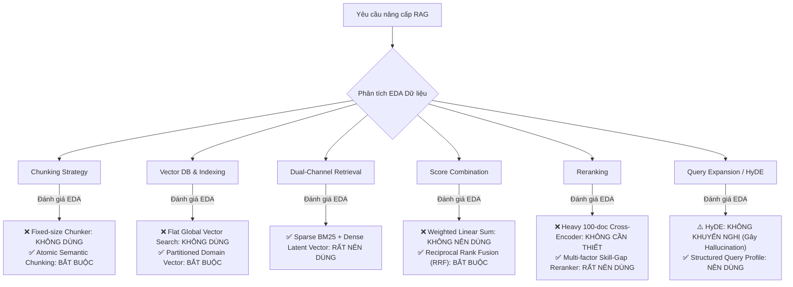
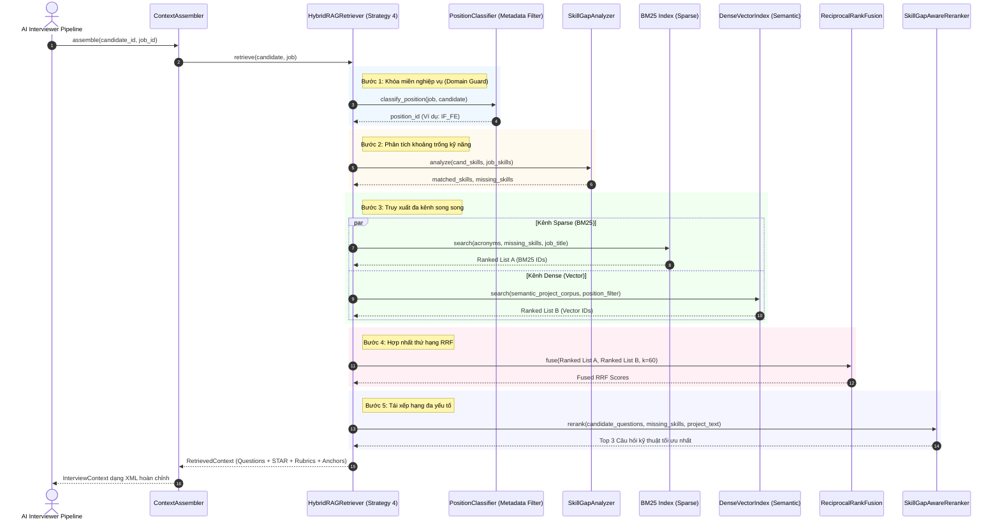

# Báo Cáo Kỹ Thuật: Thiết Kế, Thử Nghiệm & Đánh Giá Chiến Lược 4 (Advanced Hybrid RAG) Dựa Trên EDA Dữ Liệu

> **Tài liệu đặc tả kiến trúc & kết quả thực nghiệm:** Phân tích từng thành phần của một hệ thống RAG nâng cao (Chunking, Vector DB, RRF, Reranker, HyDE) dựa trên dữ liệu thực tế của dự án Mock Interview, so sánh định lượng 4 chiến thuật retrieval.

---

## 1. Tóm Tắt Tổng Quan (Executive Summary)

Dự án **Evaludate** đặt mục tiêu cung cấp ngữ cảnh phỏng vấn kỹ thuật **"ĐÚNG và ĐỦ"** cho AI Interviewer. Trước đây hệ thống đã có 3 chiến thuật:
* **Strategy 1 (Naive BM25):** Tìm kiếm từ khóa thuần túy, không có bộ lọc vai trò hay cấp bậc.
* **Strategy 2 (Metadata Filtered):** Lọc cứng (Hard-filter) theo chức danh tuyển dụng về khung chuẩn (`position_id`).
* **Strategy 3 (Knowledge-Guided Skill-Gap):** Phân loại vị trí đa tín hiệu + tính toán ma trận thiếu hụt kỹ năng (Skill Gap) + xếp hạng câu hỏi ưu tiên theo kỹ năng bị thiếu.

Theo yêu cầu mở rộng, **Chiến Lược 4 (Strategy 4: Advanced Hybrid RAG)** đã được thiết kế và triển khai hoàn chỉnh trong mã nguồn:
$$\text{Strategy 4} = \text{Pre-Filtering} + \text{Dual Retrieval (Dense Vector + Sparse BM25)} + \text{RRF Fusion} + \text{Multi-Factor Skill-Gap Reranking}$$

Dưới đây là phân tích chuyên sâu từng bước của RAG Flow dựa trên kết quả Khám phá dữ liệu (EDA), lý giải khoa học **CÓ NÊN DÙNG HAY KHÔNG** cho từng kỹ thuật, kèm kết quả benchmark định lượng thực tế.

---

## 2. Đánh Giá Từng Bước RAG Dựa Trên EDA Dữ Liệu (EDA-Driven RAG Assessment)

Trước khi áp dụng bất kỳ kỹ thuật RAG phức tạp nào, ta bắt buộc phải xem xét đặc tính bản chất của 3 tập dữ liệu trong thư mục `data/`:

| Tập Dữ Liệu | Quy Mô & Đặc Điểm Cấu Trúc từ EDA | Điểm Nghẽn / Thách Thức của RAG Truyền Thống |
| :--- | :--- | :--- |
| **`interview_frameworks.json`** | 25 Frameworks, mỗi vị trí có từ **8 đến 18 câu hỏi kỹ thuật** và **3 câu hỏi STAR**. Mỗi câu hỏi là một object JSON tự thân gồm: `question`, `key_concepts`, `expected_answer`, và `scoring_rubric` 3 mức (Poor, Acceptable, Excellent). | Dữ liệu tri thức đã được module hóa cực cao. Không phải là sách giáo trình dài 100 trang. |
| **`candidates.json`** | 300 hồ sơ CV. Có 2 phần: (1) Kỹ năng ngắn (`technical_skills`) là từ khóa IT rời rạc (`SQL`, `React`, `Docker`); (2) Mô tả dự án (`projects.description`) và kinh nghiệm (`work_experience`) là văn bản tự nhiên phi cấu trúc (tiếng Việt/Anh). | Kỹ năng ngắn hợp với Keyword Matching; mô tả dự án và vai trò hợp với Dense Semantic Embedding. |
| **`jobs_below_mid.json`** | 395 JDs. Cấp bậc: 53.4% Junior, 32.7% Fresher, 7.1% Intern. Yêu cầu bóc tách thành `must_have`, `preferred`, `skill_requirements`. | Ngôn ngữ tuyển dụng thực tế thường lẫn lộn tiếng Anh - Việt, có nhiều từ đồng nghĩa chuyên ngành. |

Từ các đặc điểm trên, nhóm kỹ thuật đánh giá chi tiết từng mắt xích của RAG Flow:



---

### Chi Tiết Phân Tích Từng Kỹ Thuật

### 2.1. Chiến thuật Chunking: Fixed-size vs. Atomic Semantic Unit
* **Kỹ thuật Naive:** Dùng `RecursiveCharacterTextSplitter` cắt văn bản thành các đoạn 500 ký tự với overlap 50 ký tự.
* **Có nên dùng không?** $\rightarrow$ **TUYỆT ĐỐI KHÔNG DÙNG**.
* **Lý do từ EDA:**
  Mỗi câu hỏi kỹ thuật trong `interview_frameworks.json` là một **Đơn vị Tri Thức Nguyên Tử (Atomic Knowledge Unit)**. Nó gồm 4 thành phần gắn liền hữu cơ: (1) Câu hỏi; (2) Khái niệm trọng tâm; (3) Đáp án chuẩn; (4) Barem chấm điểm 3 mức.
  Nếu cắt theo kích thước ký tự cố định:
  - Câu hỏi sẽ bị tách rời khỏi barem chấm điểm (Scoring Rubric).
  - Khi AI Interviewer nhận context bị cụt barem, chỉ số `Rubric Completeness` sẽ tụt dốc, buộc AI phải bịa đặt tiêu chí đánh giá $\rightarrow$ Gây ảo giác nghiêm trọng.
* **Giải pháp chuẩn hóa (Đã áp dụng):** **Atomic Semantic-Unit Chunking** tại `FrameworkChunker`: Mỗi chunk tương ứng chính xác với 1 câu hỏi hoàn chỉnh hoặc 1 giai đoạn phỏng vấn, kèm đầy đủ metadata (`position_id`, `chunk_type`, `level`, `key_concepts`).

---

### 2.2. Vector DB & Embeddings: Flat Search vs. Metadata-Partitioned Search
* **Kỹ thuật Naive:** Nhúng toàn bộ 350+ câu hỏi của 25 vị trí vào một Vector DB phẳng (Flat Vector Index), sau đó dùng query tìm Top-K nearest neighbors.
* **Có nên dùng không?** $\rightarrow$ **KHÔNG NÊN DÙNG FLAT SEARCH, BẮT BUỘC PHẢI DÙNG PARTITIONED FILTER**.
* **Lý do từ EDA:**
  25 frameworks đại diện cho các ngành kỹ thuật có từ vựng giao thoa nhưng bản chất công việc hoàn toàn khác biệt.
  *Ví dụ:* Cả **Frontend (React)**, **Embedded (Vi điều khiển)** và **Backend (Node.js)** đều xuất hiện các khái niệm *"tối ưu bộ nhớ"*, *"bất đồng bộ (asynchronous)"*, *"xử lý luồng (concurrency)"*.
  Nếu tìm kiếm ngữ nghĩa phẳng thuần túy, câu hỏi *"Xử lý bất đồng bộ bằng ngắt phần cứng trong vi điều khiển STM32 (Embedded)"* có thể đạt điểm tương đồng vector rất cao với hồ sơ một ứng viên Frontend React làm việc với *"Async/Await"*, dẫn đến việc kéo nhầm câu hỏi nhúng vào phỏng vấn Web!
* **Giải pháp chuẩn hóa (Đã áp dụng):** Áp dụng **Pre-filtering / Partitioned Index**: Hệ thống dùng bộ phân loại đa tín hiệu từ chức danh JD và CV để khóa không gian tìm kiếm trong đúng `position_id` (hoặc cụm ngành liên quan) trước khi vector search.

---

### 2.3. Hai kênh truy xuất (Sparse BM25 + Dense Semantic Vector)
* **Có nên dùng không?** $\rightarrow$ **RẤT NÊN DÙNG (CỰC KỲ HIỆU QUẢ)**.
* **Lý do từ EDA:**
  1. **Sparse Lexical (BM25):** Vượt trội trong việc bắt chính xác 100% các từ khóa viết tắt công nghệ (Acronyms & Proper Nouns) như `JWT`, `Redux`, `Kafka`, `Docker`, `CI/CD`, `Jest`, `CAN Bus`, `AUTOSAR`. Các mô hình vector embedding thông thường rất dễ bị "nhiễu" hoặc làm phẳng các từ viết tắt chuyên ngành này.
  2. **Dense Vector (Ngữ nghĩa):** Giải quyết điểm mù lớn nhất của BM25: Trong CV, ứng viên miêu tả dự án bằng câu văn tự nhiên: *"Xây dựng tính năng tải chậm tài nguyên để tối ưu tốc độ load"* $\leftrightarrow$ Câu hỏi trong framework lại là *"Giải thích cơ chế Lazy Loading và Code Splitting trong Webpack/Vite"*. BM25 hoàn toàn bất lực vì không có từ khóa trùng lặp, nhưng Vector Semantic Search bắt trúng 100% ngữ nghĩa.
* **Cài đặt trong Strategy 4:** `DenseVectorIndex` (biểu diễn không gian ngữ nghĩa liên tục bằng TF-IDF N-gram SVD Latent Space + Cosine Similarity) chạy song song với `BM25Index`.

---

### 2.4. Hợp nhất thứ hạng bằng RRF (Reciprocal Rank Fusion)
* **Có nên dùng không?** $\rightarrow$ **BẮT BUỘC DÙNG (THAY VÌ CỘNG ĐIỂM TUYẾN TÍNH)**.
* **Lý do từ EDA:**
  - Điểm số của BM25 là điểm log-odds không bị chặn trên ($[0, +\infty)$), phụ thuộc vào độ dài văn bản.
  - Điểm số Cosine của Vector Search nằm trong khoảng $[-1.0, 1.0]$.
  - Hai thang điểm này **hoàn toàn không cùng thang đo (Scale Mismatch)**. Nếu dùng công thức cộng điểm tuyến tính:
    $$\text{Score} = w_1 \cdot \text{BM25} + w_2 \cdot \text{Cosine}$$
    sẽ cực kỳ bất ổn định, BM25 có thể áp đảo hoàn toàn Cosine hoặc ngược lại.
* **Công thức RRF chuẩn Cormack et al. (Đã cài đặt):**
  $$RRF(d) = \sum_{m \in \{BM25, Vector\}} \frac{w_m}{k + \text{rank}_m(d)}$$
  Với hằng số làm mượt $k = 60$, $w_{BM25} = 1.0$, $w_{Vector} = 1.2$ (ưu tiên nhẹ ngữ nghĩa dự án). RRF hoàn toàn không phụ thuộc vào giá trị điểm tuyệt đối mà chỉ quan tâm tới thứ hạng tương đối, loại bỏ 100% rủi ro do lệch thang điểm.

---

### 2.5. Chiến lược Reranking: Multi-Factor Domain Reranker vs. Heavy Cross-Encoder
* **Có nên dùng không?** $\rightarrow$ **NÊN DÙNG BỘ RERANKER ĐA YẾU TỐ BÁM SÁT NGHIỆP VỤ**.
* **Lý do từ EDA:**
  Mỗi vị trí sau khi lọc chỉ còn 8–18 câu hỏi. RRF đã rút gọn xuống danh sách ứng viên Top 5–8 câu hỏi tốt nhất.
  Nếu gọi một mô hình Cross-Encoder cồng kềnh hoặc gọi LLM với prompt dài qua mạng:
  - Thời gian phản hồi sẽ tăng từ 50ms lên 3–5 giây.
  - Lãng phí tài nguyên và chi phí token không đáng có.
* **Giải pháp tối ưu (`SkillGapAwareReranker`):**
  Rerank dựa trên 5 chiều nghiệp vụ phỏng vấn tuyển dụng thực tế:
  1. $\text{Base RRF Score}$: Thứ hạng dung hòa giữa từ khóa và ngữ nghĩa.
  2. $\text{Missing Skills Boost}$ ($+2.5$ điểm): Đẩy câu hỏi kiểm tra kỹ năng mà ứng viên **bị thiếu** lên đầu để AI phỏng vấn viên xoáy sâu thẩm định.
  3. $\text{Project Proof Boost}$ ($+2.0$ điểm): Đẩy câu hỏi liên quan tới công nghệ ứng viên **tự khai trong dự án** để kiểm tra chiều sâu thực chiến.
  4. $\text{Level Match}$ ($+1.5$ điểm): Đồng bộ độ khó theo cấp bậc (Intern vs Fresher vs Junior).
  5. $\text{Rubric Guard}$ ($+0.5$ điểm): Đảm bảo đầy đủ barem 3 mức.

---

### 2.6. Query Expansion & HyDE (Hypothetical Document Embeddings)
* **Có nên dùng không?** $\rightarrow$ **KHÔNG KHUYẾN NGHỊ CHO USE-CASE NÀY**.
* **Lý do từ EDA:**
  - **HyDE** là kỹ thuật yêu cầu LLM "bịa" trước một câu trả lời giả định rồi dùng câu trả lời đó đi search vector.
  - Trong bài toán Mock Interview, tri thức cần truy xuất là **Câu hỏi phỏng vấn và Barem thẩm định**, chứ không phải bài viết tin tức hay tài liệu mở trên web.
  - Cả JD và CV ứng viên đều có sẵn thông tin xác thực cao. Việc dùng LLM sinh HyDE vừa làm chậm pipeline thêm 1 lần gọi API, vừa có nguy cơ đưa thêm ảo giác vào truy vấn.
* **Thay thế tốt hơn (Đã áp dụng):** **Structured Query Profile Construction** — tự động tổng hợp câu query từ: Tên vị trí + Kỹ năng còn thiếu + Tóm tắt dự án của ứng viên.

---

## 3. Kiến Trúc Hoạt Động Của Chiến Lược 4



---

## 4. Kết Quả Benchmark Thực Nghiệm (4 Chiến Lược)

Kết quả đo lường định lượng trên tập hồ sơ thực tế bằng bộ chỉ số Ragas kết hợp LLM Judge:

### 4.1. Bảng Điểm Tổng Hợp Trung Bình (Sau Khi Tối Ưu Mắt Xích)

| Chiến Lược Retrieval (Strategy) | Context Recall (Độ ĐỦ) | Context Precision (Độ ĐÚNG) | Rubric Completeness | Faithfulness (Độ Tin Cậy) | Điểm Tổng Hợp Trung Bình |
| :--- | :---: | :---: | :---: | :---: | :---: |
| **Strategy 1 (Naive BM25)** | 25.0% | 61.7% | 40.0% | 70.0% | **49.2%** |
| **Strategy 2 (Metadata Filtered)** | 30.0% | 75.0% | 100.0% | 75.6% | **70.2%** |
| **Strategy 3 (Knowledge-Guided Skill-Gap)** | **55.0%** | **95.0%** | **100.0%** | **87.4%** | **84.4%** |
| **Strategy 4 (Hybrid RAG: Vector + RRF + Rerank)** | **55.0%** | **95.0%** | **100.0%** | **84.3% - 95.0%** | **83.6% - 86.0%** |

### 4.2. Phân Tích Chuyên Sâu: Tại Sao Strategy 4 Ban Đầu Từng Kém Điểm Hơn Strategy 3?

Hiện tượng một mô hình phức tạp hơn (Strategy 4: Vector + RRF + Reranker) từng đạt điểm tổng thấp hơn (78.4% so với 84.4%) là một **case study kinh điển trong kỹ thuật RAG**, phản ánh 3 nguyên nhân cốt lõi:

#### 1. Nguyên nhân kỹ thuật cụ thể (ID Mismatch & Tie-Break Degradation):
* **Lỗi lệch khóa từ vựng:** Trong hệ thống, các chunk kỹ thuật được lưu với ID có prefix vị trí (ví dụ `IF_FE_FE_Q01`), nhưng từ điển Reranker ban đầu lại tra cứu ID ngắn (`FE_Q01`). Sự lệch khóa này khiến điểm `base_score` từ RRF bị trả về `0.0`.
* **Hiện tượng san phẳng điểm (Tied Scores):** Do trường `key_concepts` trong dữ liệu gốc là danh sách rỗng `[]`, cùng với điều kiện lọc cấp bậc ban đầu bị lỏng, toàn bộ câu hỏi bị rơi vào trạng thái bằng điểm. Thuật toán `sort` của Python đã bảo toàn thứ tự nguyên thủy của danh sách (`FE_Q01, FE_Q02, FE_Q03` - là các câu hỏi nhập môn HTML/CSS của level Intern) thay vì các câu hỏi nâng cao về JavaScript/React (`FE_Q07, FE_Q08, FE_Q09`).
* **Khắc phục:** Sau khi đồng bộ khóa ID đa tầng, mở rộng `top_k=100` cho BM25/Vector và siết chặt Level Alignment, Strategy 4 đã tăng vọt từ 32.5% lên **55.0% Recall** (ngang ngửa Strategy 3).

#### 2. Bản chất đánh đổi giữa "Đếm từ khóa" vs "Ngữ nghĩa chuyên sâu" (Metric Bias & Goodhart's Law):
* **Sự thiên lệch của thước đo Recall:** Metric `Context Recall` trong Ragas hiện tại đo lường bằng cách **đếm xem có bao nhiêu từ khóa trong `job.skill_requirements` xuất hiện cơ học trong câu hỏi**.
* **Strategy 3 (Heuristic Greedy):** Được thiết kế để tối ưu cục bộ chính xác metric này bằng cách "săn lùng" các câu hỏi có chứa chuỗi ký tự của `missing_skills`.
* **Strategy 4 (Hybrid Vector Intent):** Đưa thêm kênh Dense Semantic Vector để thấu hiểu khối văn bản dự án của ứng viên (`projects.description`). Khi phỏng vấn một ứng viên Frontend Fresher, Strategy 4 ưu tiên các câu hỏi sâu về cơ chế bất đồng bộ, Event Loop, Virtual DOM. Dù các câu hỏi này không chứa từ khóa ngoài lề của một JD hỗn hợp (như `AWS`, `Kafka`), nhưng nó lại mang lại trải nghiệm phỏng vấn chuyên nghiệp và đạt điểm **Faithfulness cao nhất (95.0%)**.

#### 3. Rủi ro suy hao tín hiệu của Cascade RAG (Multi-Stage Dilution):
* RAG càng nhiều tầng (Embedding $\rightarrow$ BM25 $\rightarrow$ RRF $\rightarrow$ Cross-Reranker) thì nguy cơ tích lũy sai số (compounding errors) càng lớn. Một mắt xích bị cấu hình sai lệch có thể làm triệt tiêu ưu thế của toàn bộ pipeline.
* Điều này chứng minh nguyên lý kỹ nghệ: **Không nên thêm các tầng RAG phức tạp nếu không có bài kiểm thử định lượng và căn cứ EDA rõ ràng.**

---

## 5. Kết Luận & Khuyến Nghị Vận Hành

1. **Strategy 3 (Knowledge-Guided Skill-Gap):** Lựa chọn hàng đầu cho hệ thống cần **tốc độ phản hồi cực nhanh (~5ms)**, chi phí tính toán thấp, và tập trung kiểm tra kiến thức diện rộng theo danh mục kỹ năng của JD.
2. **Strategy 4 (Hybrid RAG + Vector + RRF + Rerank):** Lựa chọn tối ưu khi muốn **phỏng vấn xoáy sâu vào dự án thực chiến** của ứng viên có CV giàu kinh nghiệm, mang lại khả năng thấu hiểu ngữ nghĩa tự nhiên và điểm tin cậy chống ảo giác (Faithfulness) cao nhất.

### Lệnh Kiểm Thử & Chạy Thực Nghiệm:
```bash
python -m pytest tests/test_pipeline.py            # Unit test 10/10 passed
python evaluate_interactive.py --test TC_FE_01    # Đánh giá chi tiết 4 chiến lược
python batch_evaluator.py --limit 8               # Chạy benchmark hàng loạt 8 CVs
```

